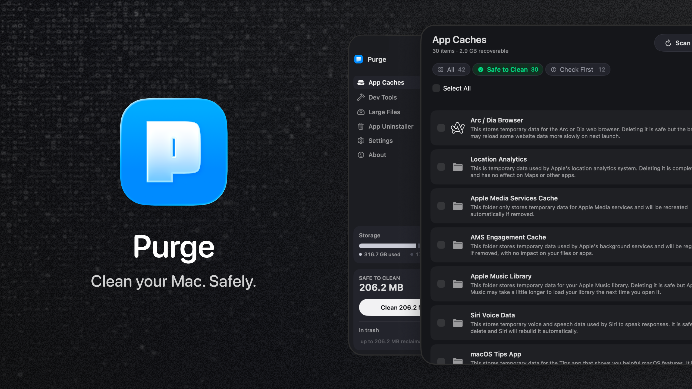

<div align="center">

  

  <h1>Purge</h1>

  <p><b>Free up your Mac. Safely.</b></p>

  <p>
    Clear out the cache and junk your Mac collects on its own.<br/>
    Open source, trash-by-default.
  </p>

<p>
  <a href="https://github.com/jithin-sabu/purge-app/actions/workflows/build.yml"></a>
  <a href="https://github.com/jithin-sabu/purge-app/blob/main/LICENSE"></a>
  <a href="https://github.com/jithin-sabu/purge-app/releases/latest"></a>
  <a href="https://github.com/jithin-sabu/purge-app/releases"></a>
  <a href="https://github.com/jithin-sabu/purge-app/stargazers"></a>
</p>

  <p>
    <a href="https://github.com/jithin-sabu/purge-app/releases/latest"><b>Download</b></a>
    &nbsp;·&nbsp;
    <a href="#installation">Install guide</a>
    &nbsp;·&nbsp;
    <a href="#build-from-source">Build from source</a>
    &nbsp;·&nbsp;
    <a href="#security">Security</a>
  </p>

  

</div>

---

Your Mac quietly fills up with cache and junk you never see and never asked for. Purge finds it, marks what is safe, and clears it in one click.

> [!NOTE]
> Nothing is ever deleted permanently. Everything moves to the Trash, so anything can come back.

You do not need to understand any of it to use it. But if you ever want to check, every item carries a plain-English explanation and a safety label, so nothing gets touched that you cannot see and verify first.

---

## Features

### App Caches

Scans `~/Library/Caches`, sandbox container caches, and common system junk:

- Per-app cache folders with friendly names, brand icons, and a plain-English explanation if you want to read it
- System Junk like application logs, crash reports, macOS installers, font cache
- Large media caches from creative apps like Premiere Pro and After Effects
- Duplicate cache locations for the same app merged into a single row
- Results stream in as they are found

### Dev Tools

Three sections in one view:

- **Global dev tool caches**: Xcode (Derived Data, Archives, DeviceSupport), Homebrew, npm, pnpm, Yarn, CocoaPods, Gradle, Flutter, Docker Desktop, VS Code, Cursor, JetBrains, Cargo, Terraform, and more
- **iOS Simulators**: unused simulator runtimes grouped together (booted simulators are skipped)
- **Developer projects**: `node_modules`, Python virtual environments, Rust `target`, Flutter build output, Xcode `Pods`, Android `.gradle`, and other artifacts grouped by project

In **Settings → Developer Projects**, choose **Consider stale after** (1 month to 2 years, or Show all) to control which project folders appear.

### Large Files

Find space-hogging personal files without digging through folders:

- Scans **Documents**, **Desktop**, **Downloads**, **Movies**, **Music**, and **Pictures**
- Skips managed libraries (Photos, iMovie, Music, and similar), hidden folders, and project folders like `node_modules`, `Pods`, `DerivedData` and build output. Deleting a single file out of a dependency tree only breaks the install, so those belong in Dev Tools, which removes them a folder at a time
- **Search** filters the list as you type, matching the file name, the folder it sits in, and its source label
- Filter by **size** (5 MB to 1 GB) and **last used** (any time up to over 1 year ago)
- Category chips for videos, audio, images, PDFs, archives, documents, AI models, and other files
- **Duplicates**: a byte-for-byte scan finds identical copies, groups them together, and shows how much you'd reclaim by keeping one. A **Duplicates** chip gathers them in one place; Purge never picks which copy to keep — that's your call
- Sort by size, date, or name; select files and review before deleting
- **Quick Look** preview and **Reveal in Finder** from each row
- Deletions move files to **Trash**, so nothing is permanently erased

Large Files is separate from cache cleanup: these are your personal files, not rebuildable caches.

#### Local AI models

Models you downloaded with **Ollama** or **LM Studio** are often the largest files on a Mac and are easy to forget. They appear in Large Files under the **AI Models** category, one row per model, named the way you installed it. Purge understands Ollama's content-addressed storage, so a model's size counts only the bytes that would actually be reclaimed rather than blobs shared with another model.

### Safety labels

Purge assigns a safety label to every item it recognizes:

| Label | Meaning |
|-------|---------|
| ✅ **Safe to Clean** | Known cache or rebuildable artifact, safe to remove |
| ⚠️ **Check First** | May be safe, but could cause inconvenience |

Filter with **All**, **Safe to Clean**, or **Check First** (⌘1–⌘3). Sort by size, date modified, or name.

Unidentified folders are left out of the list entirely. Purge only shows what it knows about.

The labels and explanations are there to be checked, not read cover to cover. Clean the safe items in one click and move on, or open the reasoning behind any single row first. Either way is fine.

### Cleaning

- **Clean**: one-click cleanup from the sidebar. The button names the exact amount it will move, and only touches Safe to Clean items, with git and lockfile checks
- **Clean Selected**: pick specific rows, review in a confirmation sheet, then delete
- **Clean Safe Files**: same safe cleanup from the menu bar
- **Scheduled cleaning**: in **Settings → Cleaning Schedule**, enable **Run automatic cleaning** and choose **How often** (weekly, monthly, or every 3 months). Purge sends a local reminder and cleans safe items when you open the app, so the cleanup keeps happening without you thinking about it
- All deletions move items to **Trash**, not permanent removal

### Settings

- **Appearance**: Light, Dark, or System
- **Cleaning Schedule**: automatic safe cleanup with a frequency, the next-clean date, and a summary of the last clean
- **Developer Projects**: stale-project threshold for developer artifact scanning
- **Excluded from scans**: folders you've told Purge to leave alone, each with its current size. Right-click any scan result and choose **Exclude from scans** to add one. Excluding only ever narrows what Purge looks at
- **Cleaning History**: every automatic and manual clean, with the space freed and the item count. Open one to see what was moved to the Trash and what was skipped

### More

- **First-run onboarding**: welcome, permissions (Full Disk Access and optional login item), first scan, results review, and a safe clean walkthrough
- **Menu bar companion**: recoverable space at a glance, quick open, and scan/clean actions
- **Disk summary**: sidebar shows used/free space and how much is safe to recover
- **In-app updates**: the About screen checks for, downloads, and installs new versions

### Keyboard shortcuts

| Shortcut | Action |
|----------|--------|
| ⌘R | Scan — rescan App Caches and Dev Tools |
| ⇧⌘R | Scan All — the same rescan, from any tab |
| ⌘1–⌘3 | Filter by All, Safe to Clean, or Check First |

---

## Download

<div align="center">

<a href="https://github.com/jithin-sabu/purge-app/releases/latest"></a>

</div>

---

## Installation

There are two ways to install Purge: with Homebrew if you live in the terminal, or by downloading the app directly. Both land in the same place.

### Install with Homebrew

```bash
brew install --cask jithin-sabu/tap/purge
```

This taps the repo and installs Purge in one step, and Homebrew verifies the download's checksum for you automatically.

### Install manually

The steps below walk through the direct download.

#### Step 1: Download

Click the download link above and download the `.dmg`.

#### Step 2: Verify your download (optional but recommended)

> [!TIP]
> Since Purge deletes files, verifying the checksum confirms your download is byte-for-byte the one that was published, with nothing altered in transit.

Each release includes a matching `.dmg.sha256` checksum file. Download both the `.dmg` and its `.dmg.sha256` file into the same folder, then in Terminal:

```bash
cd ~/Downloads
shasum -a 256 -c Purgev*.dmg.sha256
```

A result ending in `OK` means the file matches the published release.

#### Step 3: Install

Open the `.dmg` and drag Purge to your Applications folder.

#### Step 4: Open Purge

Double-click Purge to open it. Purge is notarized by Apple, so it opens normally with no extra steps.

#### Step 5: Grant Full Disk Access

Purge needs Full Disk Access to scan your cache folders.

1. Click **Open Privacy Settings** inside the app
2. Find Purge in the list
3. Turn on the toggle next to Purge
4. Come back to the app and click **I've granted access**

---

## Updating

Purge updates itself in place. Once a day it checks for a new version, and when one is available the update window appears with the release notes. Choose **Install Update** and Purge downloads it, verifies its signature, installs it, and relaunches. You don't need to visit the release page or drag anything.

Nothing is ever installed without your confirmation. You can also check whenever you like from the **About** screen, and if you'd rather Purge didn't check on its own, turn off **Check for updates automatically** in **Settings → Updates**.

Updates are delivered through [Sparkle](https://sparkle-project.org), the standard update framework for Mac apps outside the App Store. Each update is signed with a key that lives only on the developer's machine, and Purge refuses any download that doesn't carry a matching signature.

### Updating with Homebrew

If you installed through Homebrew, you can update from the terminal instead:

```bash
brew upgrade --cask purge
```

Either route is fine. Your settings, cleaning schedule, and history are kept whichever way you update; they live separately from the app. You won't need to grant Full Disk Access again either, since the permission stays with Purge.

You can also browse past versions on the [releases page](https://github.com/jithin-sabu/purge-app/releases) anytime.


---

## Build from source

Prefer to build Purge yourself instead of downloading the release? Here is how.

### Prerequisites

- macOS 13.0 or later
- **Xcode 16 or later** (from the Mac App Store). The project format and its default-actor-isolation build setting need Xcode 16; earlier versions won't open it
- [Node.js](https://nodejs.org) 18+ and npm, only needed if you want to regenerate brand icons

Dependencies are resolved by Swift Package Manager when you first build. The only one is [Sparkle](https://github.com/sparkle-project/Sparkle), which handles in-app updates.

### Step 1: Clone the repo

```bash
git clone https://github.com/jithin-sabu/purge-app.git
cd purge-app
```

### Step 2: Build and run

Open the project in Xcode and run:

```bash
open purge.xcodeproj
```

Then select the **purge** scheme and press **⌘R**.

Or build straight from the command line:

```bash
# Build a Debug app
xcodebuild -project purge.xcodeproj -scheme purge -configuration Debug build

# Build a Release app
xcodebuild -project purge.xcodeproj -scheme purge -configuration Release build
```

The built `Purge.app` is written under Xcode's DerivedData folder (the build output ends with its path).

### Optional: regenerate brand icons

The app cache icons are generated from [simple-icons](https://simpleicons.org). To rebuild them:

```bash
npm install
npm run generate:icons
```

### Running the tests

```bash
xcodebuild test -project purge.xcodeproj -scheme purge -destination 'platform=macOS' CODE_SIGN_IDENTITY="" CODE_SIGNING_REQUIRED=NO CODE_SIGNING_ALLOWED=NO
```

The signing flags matter: without a development certificate on the machine, the test build fails before a single test runs. Continuous integration builds the same way.

---

## Requirements

- macOS 13.0 or later
- Full Disk Access permission
- Xcode command-line tools (optional, for full iOS Simulator listing)

---

## Privacy

Purge runs entirely on your Mac. Scans, explanations, manual overrides, and cleanup history stay in local Application Support. Nothing is uploaded.

The one time Purge talks to the network is the update check: once a day it fetches a small XML file from GitHub to see whether a newer version is available. It sends nothing about you or your Mac, and you can turn it off in **Settings → Updates**.

Purge never reads or sends file contents.

---

## Security

Purge deletes files, so safety is the point. A few things worth knowing:

- **Trash by default**: Nothing is permanently deleted. Items move to the macOS Trash and can be restored until you empty it.
- **Allowlist-based deletion**: Only paths that match an explicit safety allowlist are ever eligible for cleanup. Anything Purge does not recognize is never touched.
- **You choose what goes**: Purge shows what is reclaimable and you decide what to clear.
- **Open source**: The full deletion logic, including the allowlist, is in this repo for you to read or build from source yourself.
- **Notarized by Apple**: The app is signed and notarized, so macOS can verify it hasn't been tampered with since release.
- **Signed updates**: In-app updates are verified against a signing key before they are installed. An update that isn't signed by that key is refused, so a compromised download can't become a compromised install.

Found a safety gap or a path that could be deleted when it shouldn't be? Please report it. See [SECURITY.md](SECURITY.md) for how.

---

## Contributing

Bug reports, safety findings, and pull requests are welcome. [CONTRIBUTING.md](CONTRIBUTING.md) covers how to set up the project and what makes a change easy to review. Anything touching the safety allowlist, the never-delete protections, or the scanning logic gets extra scrutiny and takes longer to review, which is deliberate.

Security issues are the exception: report those privately through [SECURITY.md](SECURITY.md) rather than opening an issue.

---

## License

Purge is released under the [MIT License](LICENSE). You are free to use, read, modify, and distribute it.

---

## Support

Purge is free. If it saved you some disk space, you can chip in toward the running costs from the **About** screen inside the app, or directly at [Buy Me a Coffee](https://buymeacoffee.com/jithinsabu).

<div align="center">

<a href="https://buymeacoffee.com/jithinsabu"></a>

</div>

---

<div align="center">

**Jithin Sabu**

<a href="https://jithinsabu.com"></a>
<a href="https://linkedin.com/in/jithinsabu"></a>
<a href="https://x.com/sabu_jithin"></a>
<a href="mailto:design@jithinsabu.com"></a>

</div>