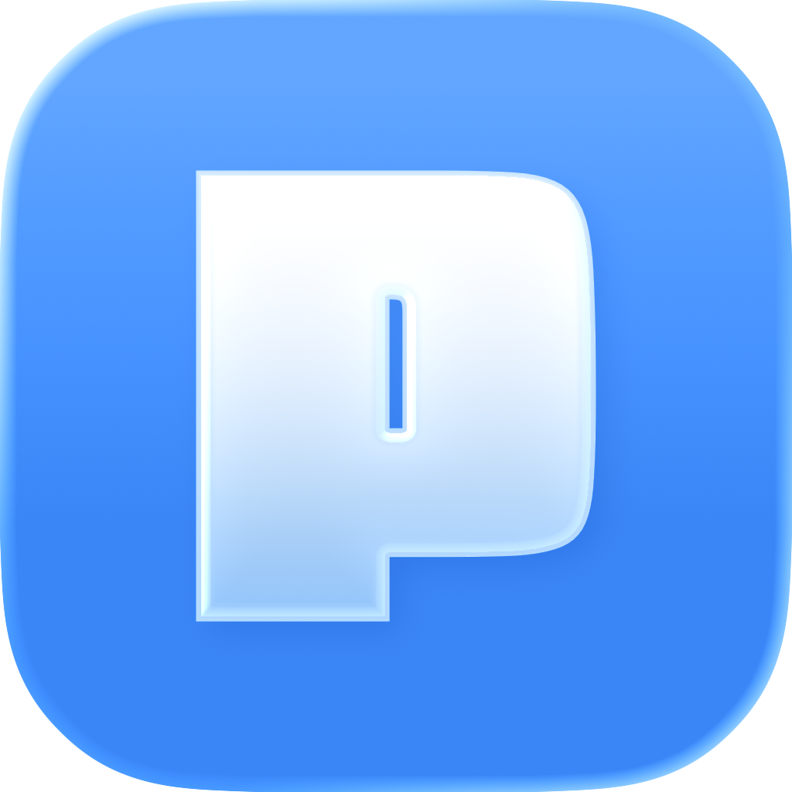
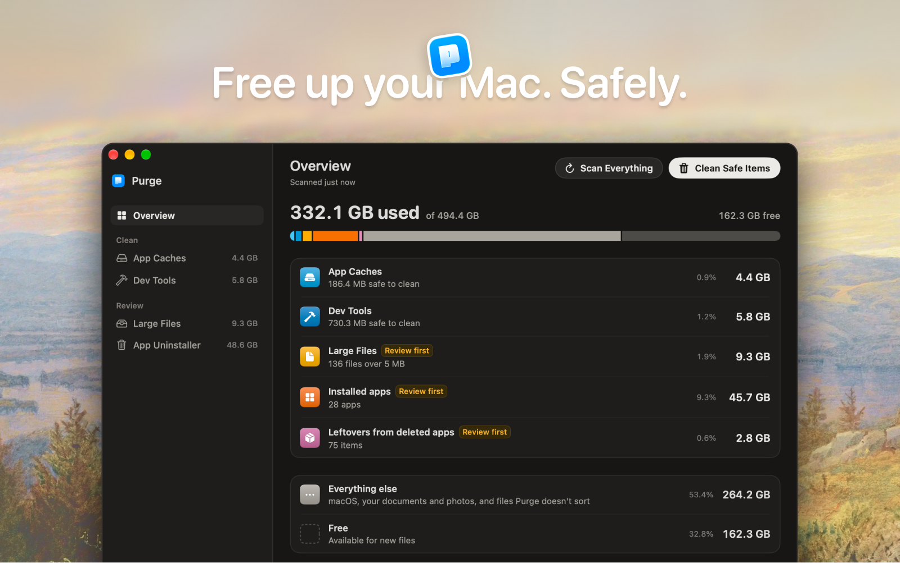

[English](README.md) | 简体中文

<div align="center">

  

  <h1>Purge</h1>

  <p><b>释放 Mac 空间，安全第一。</b></p>

  <p>
    清理 Mac 自己悄悄积累的缓存和垃圾文件。<br/>
    开源，默认移到废纸篓。
  </p>

<p>
  <a href="https://github.com/jithin-sabu/purge-app/actions/workflows/build.yml"></a>
  <a href="https://github.com/jithin-sabu/purge-app/blob/main/LICENSE"></a>
  <a href="https://github.com/jithin-sabu/purge-app/releases/latest"></a>
  <a href="https://github.com/jithin-sabu/purge-app/releases"></a>
  <a href="https://github.com/jithin-sabu/purge-app/stargazers"></a>
</p>

  <p>
    <a href="https://github.com/jithin-sabu/purge-app/releases/latest"><b>下载</b></a>
    &nbsp;·&nbsp;
    <a href="#安装">安装指南</a>
    &nbsp;·&nbsp;
    <a href="#从源码构建">从源码构建</a>
    &nbsp;·&nbsp;
    <a href="#安全">安全</a>
  </p>

  

</div>

---

> 本应用的简体中文界面基于 [@zihua-zhang](https://github.com/zihua-zhang) 的社区翻译（[Purge-zh](https://github.com/zihua-zhang/Purge-zh)）。如果本文与英文 README 有出入，请以英文 README 为准。
>
> Purge 现在同时支持英文和简体中文，并跟随 macOS 的系统语言。你也可以在“系统设置 > 通用 > 语言与地区 > 应用程序”中单独为 Purge 设置语言。

你的 Mac 会悄悄积累大量缓存和垃圾文件，你既看不到，也从没要求过它们存在。Purge 会找出这些文件，标出哪些是安全的，并一键清理。

> [!NOTE]
> 任何内容都不会被永久删除。所有项目都会移到废纸篓，因此随时可以恢复。

你不需要了解其中的细节也能使用。不过，如果你想自己核对，每个项目都附有通俗易懂的说明和安全标签，所以不会有任何你事先看不到、验证不了的内容被动到。

---

## 功能

### 概览（Overview）

- **空间都去哪了**：用一条横条展示整个磁盘。已用、可用和总容量直接取自磁盘卷，因此与系统设置中显示的一致。应用缓存、开发工具、大文件、已安装的应用以及已删除应用的残留文件，各占一段，其余部分显示为其他内容
- 每个类别一行，显示其大小和占磁盘的比例。点击某一行即可打开对应的标签页
- **扫描全部**（⇧⌘R）会逐个扫描所有类别，一次只扫一个，让 Mac 保持流畅。打开 Purge 时，它也会自动执行同样的操作。大文件和应用扫描需要完全磁盘访问权限；没有该权限时，只能扫描应用缓存和开发工具
- 每个字节只统计一次：应用的缓存文件夹计入应用缓存，不会在该应用名下重复计算

### 应用缓存（App Caches）

扫描 `~/Library/Caches`、沙盒容器缓存以及常见的系统垃圾文件：

- 每个应用一个缓存文件夹，带有易懂的名称、品牌图标，以及你想看时可以阅读的通俗说明
- 系统垃圾文件，例如应用日志、崩溃报告、macOS 安装器、字体缓存
- Premiere Pro 和 After Effects 等创意类应用产生的大型媒体缓存
- 同一应用的重复缓存位置会合并为一行
- 结果会在找到时即时显示

### 开发工具（Dev Tools）

一个视图中包含三个部分：

- **全局开发工具缓存**：Xcode（Derived Data、Archives、DeviceSupport）、Homebrew、npm、pnpm、Yarn、CocoaPods、Gradle、Flutter、Docker Desktop、VS Code、Cursor、JetBrains、Cargo、Terraform 等
- **iOS 模拟器**：把不再使用的模拟器运行环境归在一起（已启动的模拟器会被跳过）
- **开发项目**：`node_modules`、Python 虚拟环境、Rust 的 `target`、Flutter 构建产物、Xcode 的 `Pods`、Android 的 `.gradle` 以及其他生成文件，按项目分组

在 **设置 → 开发项目** 中，选择 **超过此时间视为未使用**（1 个月到 2 年，或显示全部），来控制显示哪些项目。时间从项目内任何内容最后一次变动算起，包括 git 活动，而不是看 `node_modules` 或 `target` 的日期。正在使用的项目，例如其中正运行着终端或开发服务器，或正在执行 git 命令，永远不会出现。

由 AI 编程工具（Cursor、Codex、Conductor、T3 Code 和 Claude Code）创建的 Git 工作树，只有在其仓库不再列出它们之后，才会出现在 **Orphaned Git Worktrees** 下。Git 仍在使用的工作树无论多旧都不会出现，终端或智能体正在其中工作的工作树同样不会出现。

### 大文件（Large Files）

不用逐个翻文件夹，就能找到占用空间的个人文件：

- 扫描 **文稿**、**桌面**、**下载**、**影片**、**音乐** 和 **图片**
- 跳过受管理的资源库（照片、iMovie、音乐等）、隐藏文件夹，以及 `node_modules`、`Pods`、`DerivedData` 和构建产物这类项目文件夹。从依赖目录中单独删除一个文件只会破坏安装，所以这些内容应归开发工具处理，它会按文件夹整个移除
- **搜索** 会在你输入时筛选列表，可匹配文件名、所在文件夹及其来源标签
- 按 **大小**（5 MB 到 1 GB）和 **上次使用时间**（不限时间到一年以上）筛选
- 按类别用标签筛选：视频、音频、图片、PDF、压缩文件、文稿、AI 模型和其他文件
- **重复文件**：逐字节扫描找出内容完全相同的副本，将它们归为一组，并显示只保留一份能回收多少空间。**重复文件** 标签会把它们集中在一处。**每组保留一份** 可一次清理整个标签页中的重复文件。它会为每组建议保留一份，并把其余的标记为移到废纸篓，在删除任何内容之前，你可以把要保留的那份换成别的副本。在你检查并确认之前，不会移除任何内容
- 按大小、日期或名称排序；先选择文件，检查后再删除
- 每一行都可使用 **快速查看** 预览和 **在访达中显示**
- 删除操作会把文件移到 **废纸篓**，所以不会有任何文件被永久抹除

大文件与缓存清理是分开的：这些是你的个人文件，不是可以重新生成的缓存。

#### 本地 AI 模型

你用 **Ollama** 或 **LM Studio** 下载的模型，往往是 Mac 上最大的文件，而且很容易被忘记。它们会出现在大文件的 **AI 模型** 类别下，每个模型一行，名称与你安装时一致。Purge 理解 Ollama 的内容寻址存储方式，因此模型的大小只统计真正能回收的字节，不会把与其他模型共享的数据块算进去。

### 应用卸载（App Uninstaller）

把应用拖到废纸篓，大部分内容都会留下：缓存、偏好设置、容器、已保存的状态、日志和登录辅助程序都会堆积在磁盘上。应用卸载功能可以一次性移除应用及这些残留文件。

- 列出你安装在 **应用程序** 和 **~/Applications** 中的应用，跳过系统应用和 Purge 本身。每个图块都会显示卸载后能释放的空间：应用本体加上可移除的残留文件
- 选择一个或多个应用，然后检查每个应用的清单，其中列出每个项目的路径、大小和安全标签
- 匹配很严格，所以卸载一个应用不会误伤同一开发商多个应用共用的文件。与 bundle id 和 App Group 完全匹配的项目会默认勾选；只靠名称匹配、较宽松的项目默认不勾选，由你自行确认
- 正在运行的应用会先被请求退出，而且只会以正常方式请求。如果它不退出，就会保持已安装状态，同一批中的其他应用仍会继续处理
- 所有确认的项目都会通过与 Purge 其他功能相同的删除引擎移到 **废纸篓**，所以都可以恢复
- 可选，默认关闭：在设置中开启 **应用删除后检查残留文件**。一个小型后台监测程序会在应用离开 **应用程序** 或 **~/Applications** 时发现这一变化（即使 Purge 已退出也一样），打开 Purge 并只显示该应用的残留文件，在你确认或关闭后便不再打扰。没有经过这一步检查，不会移动任何内容

### 安全标签

Purge 会为它识别的每个项目分配一个安全标签：

| 标签 | 含义 |
|------|------|
| ✅ **可安全清理** | 已知的缓存或可重新生成的内容，可以安全移除 |
| ⚠️ **先检查** | 可能是安全的，但可能带来不便 |

可用 **全部**、**可安全清理** 或 **先检查** 筛选（⌘1–⌘3）。可按大小、修改日期或名称排序。

无法识别的文件夹会完全不出现在列表中。Purge 只显示它了解的内容。

这些标签和说明是供你核对的，不需要从头读到尾。你可以直接选中安全项目并清理，也可以先展开任意一行查看背后的依据。两种方式都可以。

### 清理

- **清理所选项目**：选中特定的行，在确认面板中检查，然后删除。会先进行 Git 和 lockfile 检查
- **清理安全文件**：从菜单栏执行同样的安全清理
- **定时清理**：在 **设置 → 清理计划** 中，开启 **启用自动清理**，并选择 **清理频率**（每周、每月、每 3 个月，或按天、周、月设定的 **自定义** 间隔）。Purge 会发送本地提醒，并在你打开应用时清理安全项目，让清理在你不用惦记的情况下持续进行
- 所有删除都会把项目移到 **废纸篓**，而不是永久移除

### 设置

- **外观**：浅色、深色或跟随系统
- **清理计划**：按设定频率自动清理安全项目，显示下次清理日期和上次清理的摘要
- **开发项目**：开发工具生成文件扫描所用的“未使用项目”时间阈值
- **从扫描中排除**：你告诉 Purge 不要动的文件夹，每个都显示当前大小。右键点击任意扫描结果并选择 **从扫描中排除** 即可添加。排除操作只会缩小 Purge 的查看范围
- **清理历史记录**：每一次自动和手动清理，包含释放的空间和项目数量。打开某一条，可以看到哪些已移到废纸篓、哪些被跳过

### 更多

- **首次启动引导**：欢迎、权限（完全磁盘访问权限和可选的登录项）、首次扫描、结果检查，以及安全清理演示
- **菜单栏助手**：一眼看到可回收的空间，快速打开，以及扫描和清理操作
- **磁盘摘要**：概览显示已用和可用空间；侧边栏显示废纸篓中已有的内容，以及每个扫描标签页的大小
- **应用内更新**：在“关于”界面中检查、下载并安装新版本

### 键盘快捷键

| 快捷键 | 操作 |
|--------|------|
| ⌘R | 扫描当前标签页（在概览中为扫描全部） |
| ⇧⌘R | 扫描全部，在任何标签页都可用 |
| ⌘1–⌘3 | 按全部、可安全清理或先检查筛选 |

---

## 下载

<div align="center">

<a href="https://github.com/jithin-sabu/purge-app/releases/latest"></a>

</div>

---

## 安装

安装 Purge 有两种方式：习惯用终端的话用 Homebrew，或者直接下载应用。两种方式的结果相同。

### 使用 Homebrew 安装

```bash
brew install --cask jithin-sabu/tap/purge
```

这条命令会一步完成 tap 仓库和安装 Purge，Homebrew 还会自动为你校验下载文件的校验和。

### 手动安装

下面的步骤介绍直接下载安装的方式。

#### 第 1 步：下载

点击上方的下载链接，下载 `.dmg`。

#### 第 2 步：验证下载文件（可选，但建议这样做）

> [!TIP]
> Purge 会删除文件，所以验证校验和可以确认你下载的文件与发布的文件逐字节一致，在传输途中没有被改动。

每个版本都附带一个对应的 `.dmg.sha256` 校验和文件。把 `.dmg` 和它的 `.dmg.sha256` 文件下载到同一个文件夹，然后在“终端”中运行：

```bash
cd ~/Downloads
shasum -a 256 -c Purgev*.dmg.sha256
```

如果结果以 `OK` 结尾，说明文件与发布的版本一致。

#### 第 3 步：安装

打开 `.dmg`，把 Purge 拖到“应用程序”文件夹。

#### 第 4 步：打开 Purge

双击 Purge 即可打开。Purge 已通过 Apple 公证，所以可以正常打开，无需额外步骤。

#### 第 5 步：授予完全磁盘访问权限

Purge 需要完全磁盘访问权限才能扫描你的缓存文件夹。

1. 在应用内点击 **打开隐私设置**（Open Privacy Settings）
2. 在列表中找到 Purge
3. 打开 Purge 旁边的开关
4. 回到应用，点击 **我已授予权限**（I've granted access）

---

## 更新

Purge 会就地自动更新。它每天检查一次新版本，有新版本时会弹出更新窗口并显示发行说明。选择 **安装更新**（Install Update），Purge 会下载更新、验证签名、完成安装并重新打开。你不需要访问发布页面，也不需要拖动任何东西。

没有你的确认，不会安装任何内容。你也可以随时在“关于”界面中检查更新；如果你不希望 Purge 自行检查，可以在 **设置 → 更新** 中关闭 **自动检查更新**。

更新通过 [Sparkle](https://sparkle-project.org) 提供，这是 App Store 之外的 Mac 应用通用的标准更新框架。每个更新都使用只存放在开发者本人电脑上的密钥签名，Purge 会拒绝任何没有匹配签名的下载。

### 使用 Homebrew 更新

如果你是通过 Homebrew 安装的，也可以改用终端更新：

```bash
brew upgrade --cask purge
```

两种方式都可以。无论用哪种方式更新，你的设置、清理计划和历史记录都会保留，因为它们与应用本身分开存放。你也不需要再次授予完全磁盘访问权限，因为该权限会一直保留给 Purge。

你也可以随时在[发布页面](https://github.com/jithin-sabu/purge-app/releases)浏览以往的版本。


---

## 从源码构建

想自己构建 Purge，而不是下载发布版？方法如下。

### 前提条件

- macOS 13.0 或更高版本
- **Xcode 16 或更高版本**（来自 Mac App Store）。项目格式及其默认 actor 隔离的构建设置需要 Xcode 16；更早的版本无法打开
- [Node.js](https://nodejs.org) 18+ 和 npm，仅在你想重新生成品牌图标时需要

依赖项会在你首次构建时由 Swift Package Manager 自动解析。唯一的依赖是 [Sparkle](https://github.com/sparkle-project/Sparkle)，它负责应用内更新。

### 第 1 步：克隆仓库

```bash
git clone https://github.com/jithin-sabu/purge-app.git
cd purge-app
```

### 第 2 步：构建并运行

在 Xcode 中打开项目并运行：

```bash
open purge.xcodeproj
```

然后选择 **purge** scheme，按下 **⌘R**。

或者直接在命令行中构建：

```bash
# Build a Debug app
xcodebuild -project purge.xcodeproj -scheme purge -configuration Debug build

# Build a Release app
xcodebuild -project purge.xcodeproj -scheme purge -configuration Release build
```

构建出的 `Purge.app` 会写入 Xcode 的 DerivedData 文件夹下（构建输出的末尾会显示它的路径）。

### 可选：重新生成品牌图标

应用缓存图标由 [simple-icons](https://simpleicons.org) 生成。要重新构建它们：

```bash
npm install
npm run generate:icons
```

### 运行测试

```bash
xcodebuild test -project purge.xcodeproj -scheme purge -destination 'platform=macOS' CODE_SIGN_IDENTITY="" CODE_SIGNING_REQUIRED=NO CODE_SIGNING_ALLOWED=NO
```

这些签名参数很重要：如果机器上没有开发证书，测试构建会在任何一个测试运行之前就失败。持续集成也是这样构建的。

---

## 系统要求

- macOS 13.0 或更高版本
- 完全磁盘访问权限
- Xcode 命令行工具（可选，用于完整列出 iOS 模拟器）

---

## 隐私

Purge 完全在你的 Mac 上运行。扫描结果、说明、手动覆盖设置和清理历史记录都保存在本地的 Application Support 中。不会上传任何内容。

Purge 唯一会联网的时候是检查更新：每天一次，从 GitHub 获取一个很小的 XML 文件，以确认是否有更新的版本。它不会发送任何关于你或你的 Mac 的信息，你也可以在 **设置 → 更新** 中关闭它。

Purge 从不读取或发送文件内容。

---

## 安全

Purge 会删除文件，所以安全就是重点。以下几点值得了解：

- **默认移到废纸篓**：不会永久删除任何内容。项目会移到 macOS 废纸篓，在你清空之前都可以恢复。
- **基于允许列表的删除**：只有匹配明确的安全允许列表的路径，才有资格被清理。Purge 不认识的内容，一律不会动。
- **由你决定清理什么**：Purge 会显示哪些空间可以回收，由你决定清理哪些。
- **开源**：完整的删除逻辑（包括允许列表）都在这个仓库中，你可以阅读，也可以自己从源码构建。
- **已通过 Apple 公证**：应用经过签名和公证，因此 macOS 可以验证它自发布以来没有被篡改。
- **签名更新**：应用内更新在安装之前会用签名密钥验证。没有用该密钥签名的更新会被拒绝，因此被篡改的下载内容不会变成被篡改的安装。

发现了安全漏洞，或某个本不该被删除的路径可能被删除？请告诉我们。报告方式见 [SECURITY.md](SECURITY.md)。

---

## 参与贡献

欢迎提交错误报告、安全方面的发现和拉取请求。[CONTRIBUTING.md](CONTRIBUTING.md) 介绍了如何搭建项目，以及怎样的改动更容易审阅。凡是涉及安全允许列表、永不删除保护或扫描逻辑的改动，都会受到更严格的审查，审阅时间也更长，这是有意为之。

安全问题是例外：请通过 [SECURITY.md](SECURITY.md) 私下报告，不要公开提交 issue。

---

## 许可证

Purge 根据 [MIT 许可证](LICENSE)发布。你可以自由地使用、阅读、修改和分发它。

---

## 支持

Purge 是免费的。如果它帮你节省了一些磁盘空间，你可以在应用内的“关于”界面，或直接通过 [Buy Me a Coffee](https://buymeacoffee.com/jithinsabu)，为运营成本出一份力。

<div align="center">

<a href="https://buymeacoffee.com/jithinsabu"></a>

</div>

---

<div align="center">

**Jithin Sabu**

<a href="https://jithinsabu.com"></a>
<a href="https://linkedin.com/in/jithinsabu"></a>
<a href="https://x.com/sabu_jithin"></a>
<a href="mailto:design@jithinsabu.com"></a>

</div>
